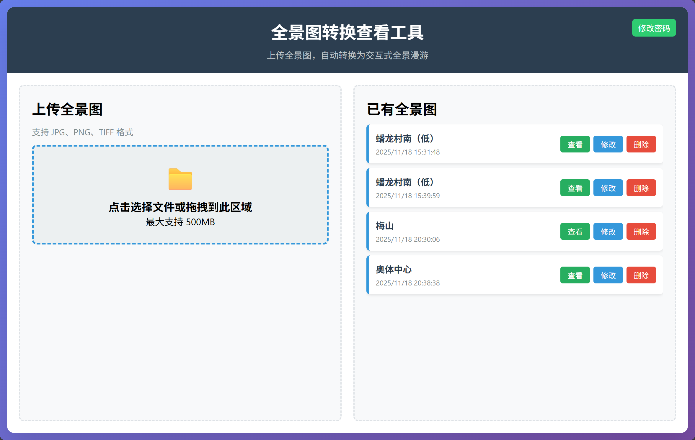

# KrpanoOnlineViewer

一个基于 Krpano 技术构建的在线全景图查看器。Krpano 是一款强大的全景图和虚拟现实浏览器，支持高质量的全景图展示与互动。本仓库构建了一个前端+后端，用户可以在前端上传2:1格式的全景图，上传至后端后，由后端调用krpano命令行，将全景图转换为可以直接浏览的html网页。前端提供便捷的入口，可以查看和管理已经完成转换的全景图。

## 截图

网页界面：

全景查看界面：

## 部署

1. 获取程序文件
   - 从[Release](https://github.com/f-shake/KrpanoOnlineViewer/releases)下载。
   - 使用源代码手动编译，确保已安装.NET 8 SDK，执行打包命令进行编译，示例：`dotnet publish KrpanoOnlineViewer -c Release -o Publish  --runtime win-x64`。本程序兼容AOT，建议打包时启用AOT。提供了一个脚本`build_win64_aot.ps1`，可一键发布为Windows 64位应用。

2. 修改配置文件`appsettings.json`
   - 修改`AccessPassword`，设置访问密码（例如：`"AccessPassword":"123456",`）
   - 修改`KrpanoExe`，指定`krpanotools.exe`的绝对文件路径（例如：`"KrpanoExe": "C:\\Users\\autod\\Documents\\Apps\\krpano-1.23.1\\krpanotools.exe"`

3. 运行一遍`Krpano Tools`，完成软件的注册

4. 选择合适的部署方式。

   - 直接打开可执行文件，使用内置的Kestrel服务器提供Web服务

   - 通过IIS进行部署，此时需要手动构建非AOT版本的二进制文件

   - 在Windows上，通过Windows服务进行托管。可以运行`CreateWindowsService.bat`注册服务，`DeleteWindowsService.bat`删除服务。注意，由于Windows服务运行在SYSTEM用户下，而我们一般会在自己登录的用户下对Krpano进行激活。因此，默认状态下，这个服务调用的Krpono会提示未激活。此时，需要进入Services.msc，找到`KrpanoOnlineViewer`服务，双击打开属性，进入登录选项卡，选择“此账户”并输入用户名和密码。然后，重启服务。

     > 本人使用直接打开可执行文件使用Kestrel服务器，然后使用Nginx进行反向代理的方式使用。注意，该后端需要支持上传大容量的文件，因此包括Nginx在内的所涉服务器，需要配置合理的请求体大小。例如，在nginx中，需要在`server`节中配置`client_max_body_size 1000M;`。

5. 输入对应的地址进行访问。

## 编译和开发

1. 编辑`KrpanoOnlineViewer.csproj`，删除`OutputPath`配置块和`BaseIntermediateOutputPath`配置块
2. 尝试生成解决方案

## 注意

本项目使用AI进行开发，其中DeepSeek贡献代码80%，ChatGPT贡献10%，个人贡献10%。